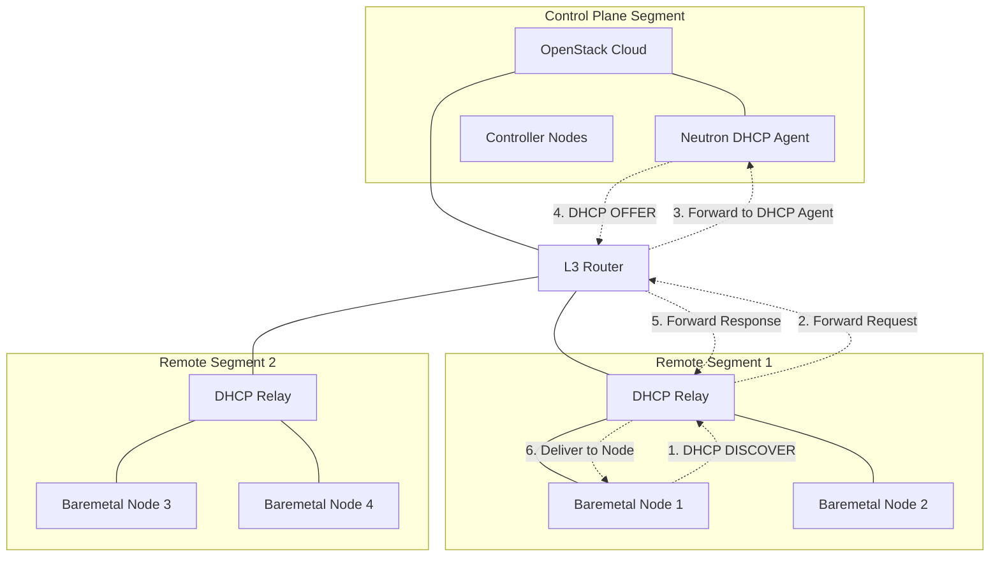

# DHCP Relay with OpenStack and Baremetal Services

## Overview

In OpenStack deployments using Routed Provider Networks, DHCP agents can service multiple segments by handling relayed requests. A single DHCP agent can serve multiple segments within a Routed Provider Network when DHCP relay services forward requests from remote segments to the centralized agent, enabling consistent network provisioning across the multi-segment infrastructure.

## Key Components

- **OpenStack Neutron DHCP Agent**: DHCP service that can handle requests from multiple segments when using DHCP relay
- **Routed Provider Networks**: Single Neutron network with multiple segments, each with its own subnet and unique physical network name
- **DHCP Relay**: Service running on routers or dedicated servers to forward requests to the DHCP agent
- **Network Segments**: Layer-2 broadcast domains with explicit subnet associations
- **Baremetal Nodes**: Physical servers requiring DHCP for provisioning across different network segments

## Network Topology Diagram

## Important Notes

- **Routed Provider Networks Required**: Neutron requires using Routed Provider Networks - a single network with multiple segments, where each segment has its own subnet
- **DHCP Agent Deployment**: A single DHCP agent can service multiple segments within a Routed Provider Network by handling relayed requests from remote segments
- **DHCP Port Configuration**: DHCP agents create ports associated with specific network segments
- **Segment-Subnet Association**: Each network segment must be explicitly associated with a specific subnet within the Routed Provider Network
- **Physical Network Mapping**: Each segment requires a unique physical network name
- **External Routing Required**: Neutron does not provide layer-3 services between segments - physical network infrastructure must handle routing between subnets
- **External Relay Configuration**: DHCP relay (configured on physical network infrastructure) forwards requests from remote segments to a centralized DHCP Agent, enabling cross-segment DHCP service

## DHCP Agent Configuration Differences

Typically, with baremetal the first one is used, e.g "Multi-Segment Networks with DHCP Relay (Routed Provider Networks)".

### Multi-Segment Networks with DHCP Relay (Routed Provider Networks)
- **Centralized DHCP Agent**: Single DHCP agent can service multiple segments by handling relayed requests
- **Route Configuration**: DHCP agent only adds link-local routes for subnets on its local segment, not for remote segments accessed via relay
- **Cross-Segment Service**: One agent handles DHCP requests from multiple segments by processing relayed requests
- **Reference**: https://opendev.org/openstack/neutron/commit/d2b82168cd35adc02599e4fe226f25cfc9b786a8 

### Multi-Segment Networks without DHCP Relay
- **Per-Segment Deployment**: Separate DHCP agent required on each network segment
- **Local Link-Local Routes**: Each agent adds direct link-local routes for subnets within its segment
- **Local DHCP Ports**: Each agent creates DHCP ports on its local segment

### Multiple Subnets on Single Segment
- **Single Agent**: One DHCP agent handles all subnets on the same network segment
- **Shared DHCP Port**: Single DHCP agent creates one DHCP port serving all subnets on the network
- **Direct Link-Local Routes**: Agent adds link-local routes for all subnets within the shared L2 domain

---

*Reference: [OpenStack Neutron - Routed Provider Networks](https://docs.openstack.org/neutron/latest/admin/config-routed-networks.html)*
